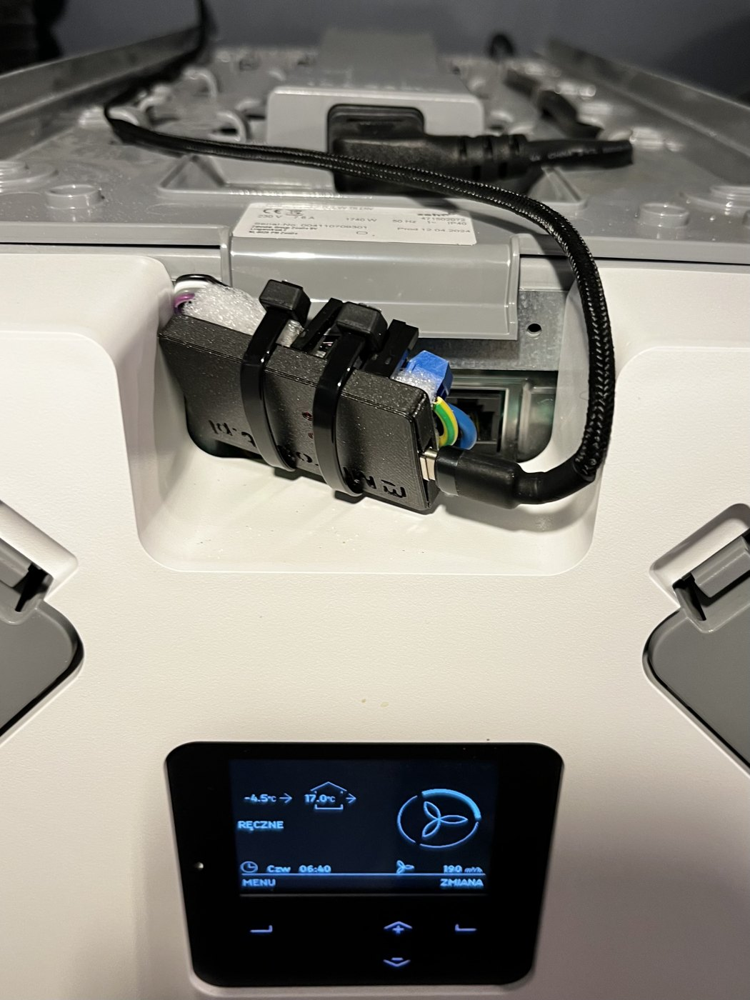
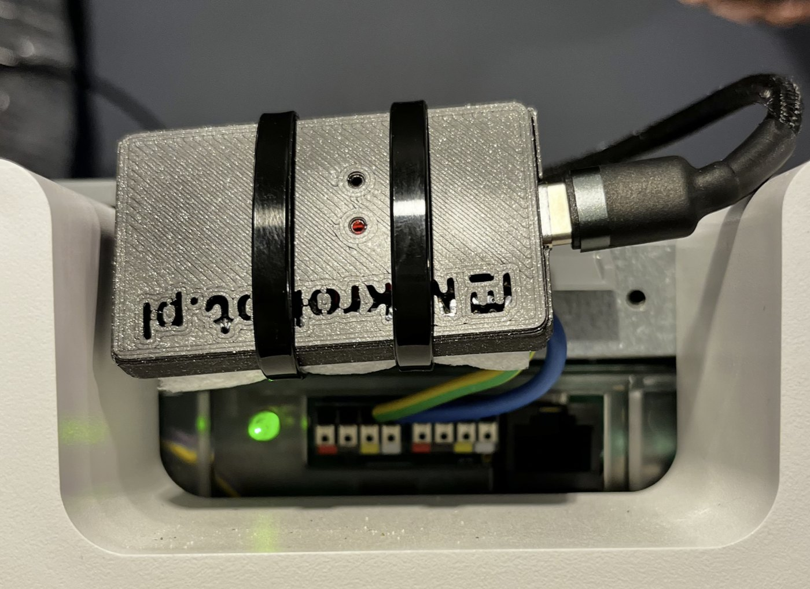
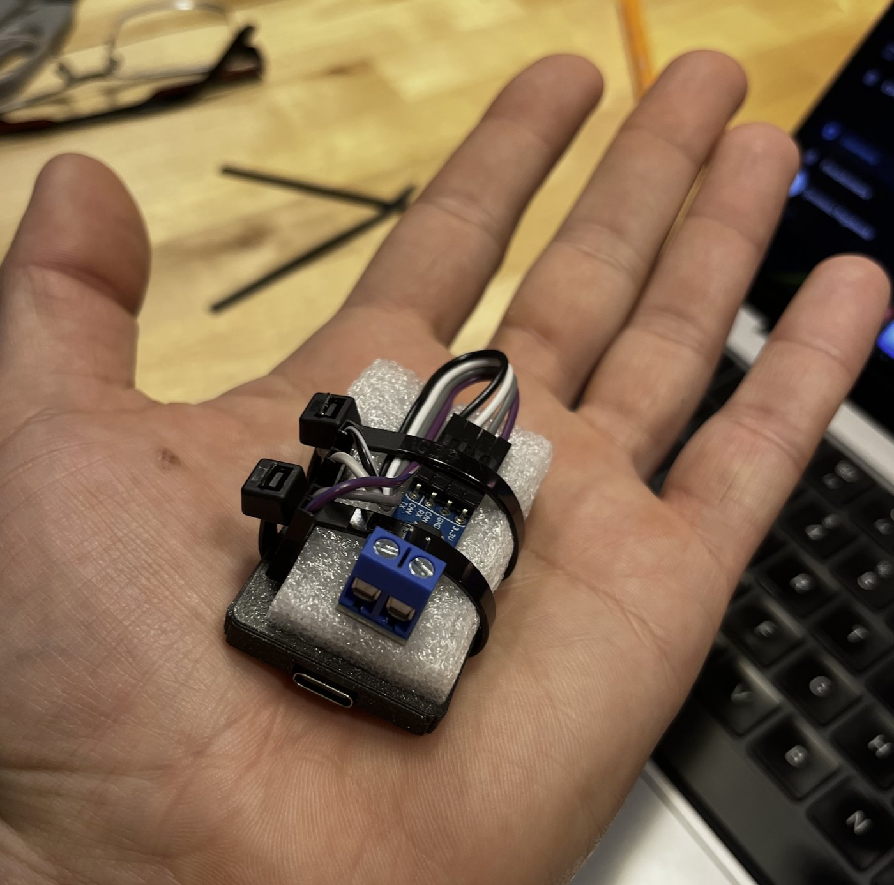
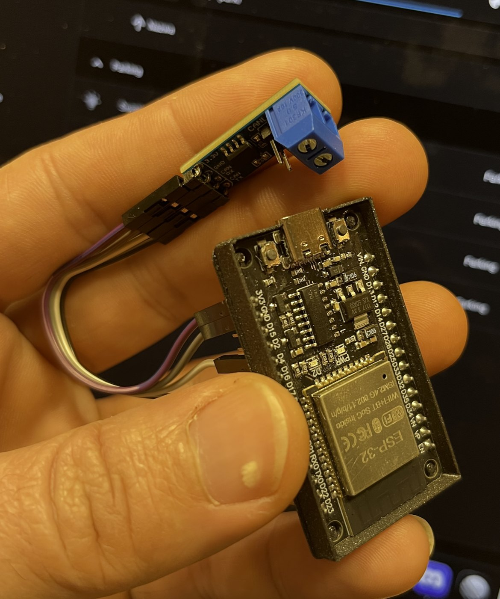
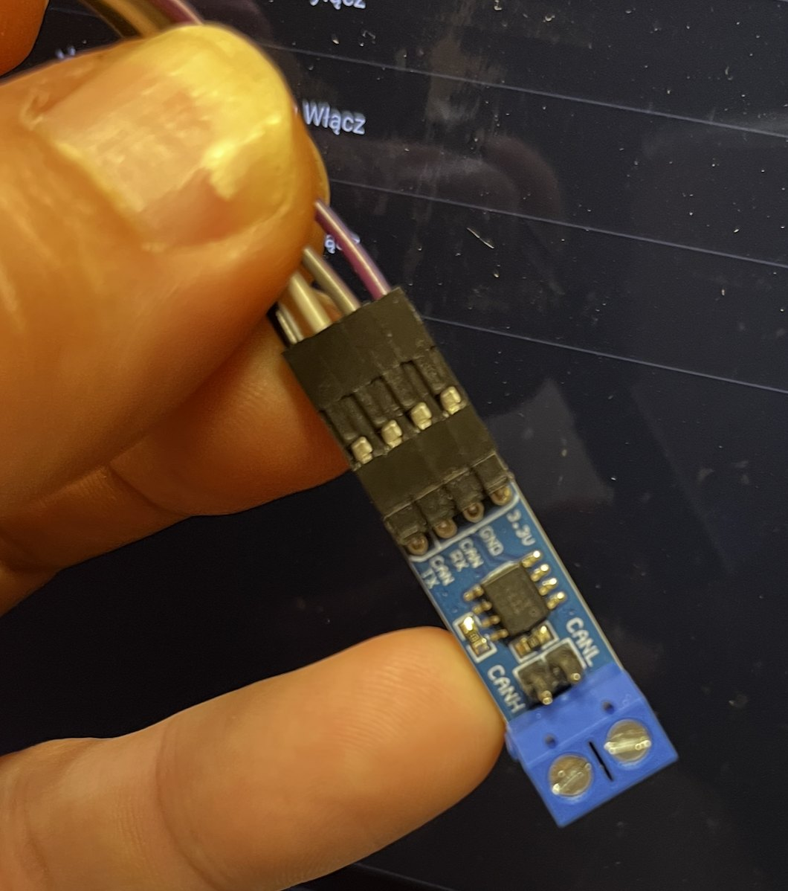
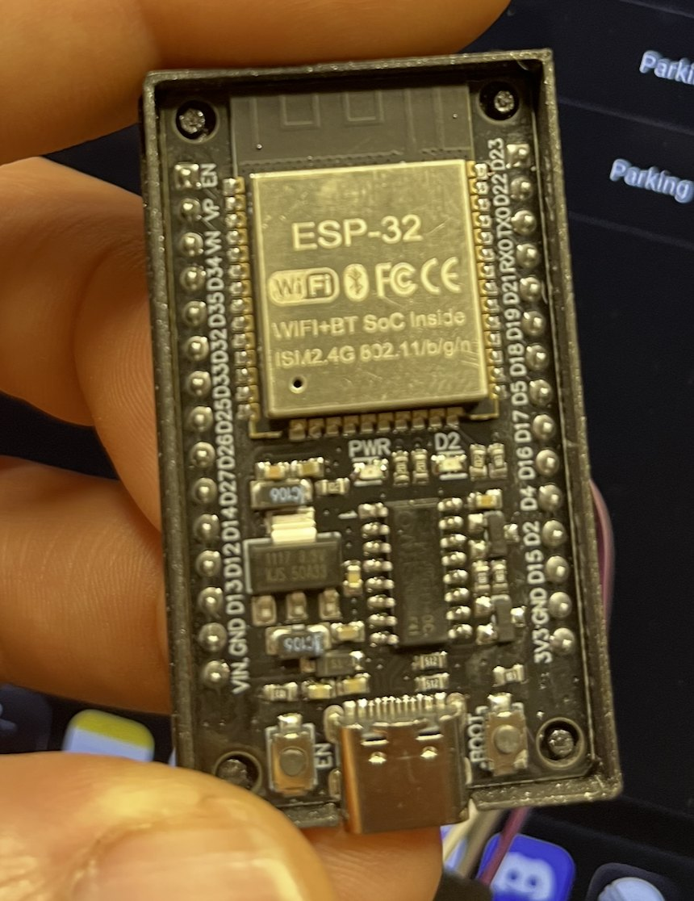
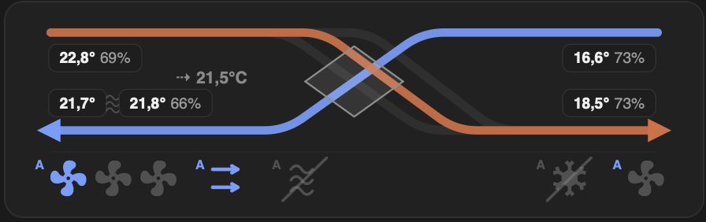

# Zehnder ComfoAir Q — ESP32 + CAN bus control

> **Fully coded by Claude AI** — not a single line of code was written manually by a human.

Control and monitor a **Zehnder ComfoAir Q** ventilation unit (heat recovery / MVHR) with a cheap **ESP32** and a **CAN transceiver**, running **ESPHome**. You get about 40 live readings and full control — fan speed, away mode, boost, bypass — over Wi-Fi, from your own scripts, **without Home Assistant**.

This is a ready-to-flash config based on the excellent [yoziru/esphome-zehnder-comfoair](https://github.com/yoziru/esphome-zehnder-comfoair) component, plus **three fixes** found during months of daily use, a simple **PHP control script**, and a **step-by-step hardware guide** with photos.

<h3>What you get:<br>temperatures · humidity · air flow · fan speed · power · bypass · filter days · saved energy · permanent fan speed · away · boost · bypass control</h3>

<br>
*The finished module on top of the unit, powered by a USB-C phone charger.*

## Hardware

| Part | Notes |
|---|---|
| **ESP32 DevKit** (ESP-WROOM-32, USB-C, 30 pins) | any common ESP32 board works |
| **Waveshare SN65HVD230 CAN module** | 3.3 V transceiver — connects to the ESP32 directly, no level shifter |
| 4 jumper wires (female–female) | ESP32 ↔ CAN module |
| 2 thin wires | CAN module ↔ unit (CAN H, CAN L) |
| USB-C power supply | a phone charger — I find them the most stable and reliable |
| optional: a small 3D-printed case | |

### Wiring

**ESP32 ↔ CAN module**

| CAN module | ESP32 |
|---|---|
| 3.3V | 3V3 |
| GND | GND |
| CAN RX | GPIO4 |
| CAN TX | GPIO5 |

**CAN module ↔ ComfoAir Q**

On top of the unit there is a **ComfoNet** connector block with coloured terminals (next to the RJ45 socket). Following the [yoziru documentation](https://github.com/yoziru/esphome-zehnder-comfoair/blob/main/docs/m5stack-atoms3.md):

| Terminal colour | Signal | Connect to |
|---|---|---|
| yellow | CAN H | CANH on the CAN module |
| white | CAN L | CANL on the CAN module |
| red | 12 V | not used — the ESP32 is powered from USB |

Only two wires go into the unit. Nothing on the CAN module was changed — no jumpers added or removed.

> ⚠ Switch the unit off at the mains before you connect anything to it.

<table>
<tr>
<td width="50%" valign="top"><br><sub>Two wires (CAN H, CAN L) go into the ComfoNet terminals on top of the unit.</sub></td>
<td width="50%" valign="top"><br><sub>Assembled: ESP32 in a printed case, CAN module on top, held with cable ties and foam.</sub></td>
</tr>
<tr>
<td width="50%" valign="top"><br><sub>ESP32 DevKit and the Waveshare CAN module with 4 jumper wires.</sub></td>
<td width="50%" valign="top"><br><sub>CAN module pins: 3.3V, GND, CAN RX, CAN TX — and the CANH / CANL screw terminal.</sub></td>
</tr>
<tr>
<td width="50%" valign="top"><br><sub>The ESP32 board used (ESP-WROOM-32, CH340C, USB-C).</sub></td>
<td width="50%" valign="top"><br><sub>The data in use — live air flow diagram in <a href="https://github.com/tymoteuszrogalewski/tymos">TymOS</a>.</sub></td>
</tr>
</table>

### Tip: shield the CAN module

The CAN module can **disturb the ESP32 Wi-Fi** a lot — in my case the ESP kept losing the connection. Wrapping the CAN module in **aluminium foil** fixed it. Keep the foil away from the ESP32 antenna (the end of the board with the wavy line), and make sure it does not touch any pins.

## Software

### 1. Flash the ESP32

You need [ESPHome](https://esphome.io) (`pip install esphome`) on any computer.

```bash
git clone https://github.com/tymoteuszrogalewski/zehnder-comfoair-q-esp32.git
cd zehnder-comfoair-q-esp32/esphome
cp secrets.example.yaml secrets.yaml
nano secrets.yaml                     # your Wi-Fi name and password, API key
esphome run comfoair-q.yaml           # first time: connect the ESP32 with a USB cable
```

Later updates go over Wi-Fi: `esphome run comfoair-q.yaml --device <ESP IP>`.

After flashing, open `http://<ESP IP>/` in a browser — you will see all readings and buttons.

Give the ESP32 a **fixed IP** (in your router, or `manual_ip` in `comfoair-q.yaml`), so your scripts always find it.

### 2. Control it

**From the command line (PHP):**

```bash
cp php/config.example.php php/config.php
nano php/config.php                   # ESP32 IP address
./reku.sh status
```

```
Mode:       Manual (limited), fan Low
Flow:       supply 183 m3/h, exhaust 189 m3/h, power 28 W
Outdoor:     17.5 C   63 %
Supply:      19.9 C   59 %   (into the rooms)
Extract:     23.1 C   57 %   (from the rooms)
Exhaust:     21.8 C   58 %   (out of the house)
Bypass:     94 %, Auto
Filter:     replace in 157 days
```

| Command | What it does |
|---|---|
| `./reku.sh low` / `medium` / `high` | permanent fan speed — stays until you change it |
| `./reku.sh auto` | back to the unit's automatic mode |
| `./reku.sh away` / `away-off` | away mode on / off |
| `./reku.sh boost` | boost for 15 minutes |
| `./reku.sh bypass-on` / `bypass-off` / `bypass-auto` | bypass on (1 h) / off (1 h) / automatic |

In your own PHP code: `require 'php/reku.inc.php';` then `reku_status()`, `reku_get('sensor', 'Outdoor Air Temperature')` or `reku_command('high')`.

**From anything else (REST):** ESPHome has a simple HTTP API — use it from bash, Python, Node-RED, cron…

```bash
curl http://ESP_IP/sensor/Outdoor%20Air%20Temperature
curl -X POST "http://ESP_IP/button/Manual%20Permanent%20High/press"
curl -X POST "http://ESP_IP/switch/Away%20Mode/turn_on"
```

**Home Assistant** also works — add the device with the ESPHome integration as usual.

## Fixes compared to the original package

All three are in `esphome/comfoair-q.yaml`, with comments.

1. **Permanent fan speed.** The built-in fan speed commands set the speed only for the unit's own timer (about 12 minutes), then it falls back to Auto. The `Manual Permanent Low / Medium / High` buttons send the same command with "no end time", so the speed really stays.
2. **The ESP does not leave manual mode by itself.** The package turns Auto Ventilation back on whenever the fan level drops to 0 for a moment (mode change, short glitch). These automations are removed — the fan entity is read-only and you control the unit with the buttons and the Away switch.
3. **No reboot every 15 minutes.** ESPHome reboots a device when no native API client (like Home Assistant) has been connected for 15 minutes. If you use only REST, that means a reboot every 15 minutes. `api: reboot_timeout: 0s` turns it off.

Also: the component version is **pinned to a commit** (`ce62828`, June 2026). `@main` would pull a different version on every rebuild and could change behaviour without warning. Update the pin on purpose, when you want to.

## Credits

- [yoziru/esphome-zehnder-comfoair](https://github.com/yoziru/esphome-zehnder-comfoair) — the ESPHome component and CAN protocol work this project is built on.
- Zehnder is not connected with this project. You use it at your own risk.

## Origin

Part of [TymOS](https://github.com/tymoteuszrogalewski/tymos) — a lightweight home automation system on Raspberry Pi, where this module runs the ventilation every day (night limits, humidity, free cooling, bypass).

## License

MIT — see [LICENSE](LICENSE). This repository contains only my config and scripts. The yoziru component is licensed under **GPL-3.0**; it is not included here — ESPHome downloads it at build time.
